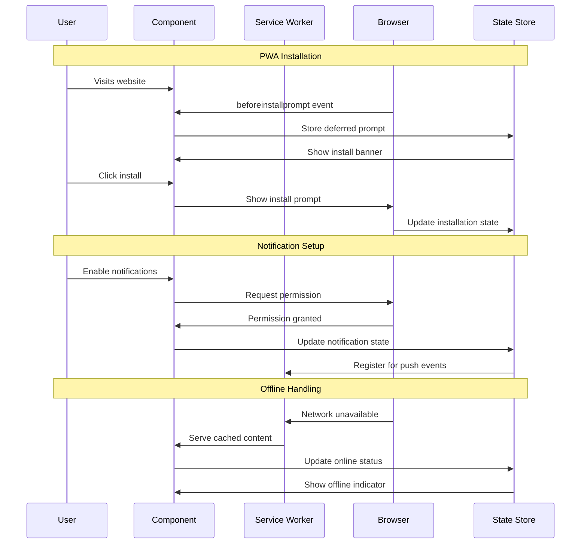

# US-004 Access Platform via Web Interface - Implementation Planning

## User Story

As an office worker, I want to access the shopping platform through a web browser or mini-program, so that I can use the service without downloading and installing a dedicated app.

## Pre-conditions

- Next.js framework is already set up in the project
- TypeScript configuration is in place
- Basic project structure exists with pages directory
- No existing app constraints that would prevent web-based implementation

## Design

### Visual Layout

The web platform will feature a responsive, modern interface optimized for both desktop and mobile use:

- **Header Navigation**: Logo, main navigation menu, user account access
- **Main Content Area**: Dynamic content area that adapts to different features
- **Sidebar/Filter Panel**: Collapsible panel for search filters and quick actions
- **Footer**: Links, contact information, and additional resources
- **Responsive Grid System**: Flexible layout that adapts to screen sizes
- **Progressive Web App (PWA)**: App-like experience with offline capabilities

### Color and Typography

**Background Colors**: 
- Primary: bg-white dark:bg-gray-900
- Secondary: bg-gray-50 dark:bg-gray-800
- Accent: bg-blue-500 hover:bg-blue-600
- Success: bg-green-500
- Warning: bg-yellow-500
- Error: bg-red-500

**Typography**:
- Headings: font-inter text-2xl font-semibold text-gray-900 dark:text-white
- Body: font-inter text-base text-gray-600 dark:text-gray-300
- Links: text-blue-600 hover:text-blue-700 dark:text-blue-400
- Small text: text-sm text-gray-500 dark:text-gray-400

**Component-Specific**:
- Cards: bg-white dark:bg-gray-800 shadow-md hover:shadow-lg border border-gray-200 dark:border-gray-700
- Buttons: bg-blue-500 text-white hover:bg-blue-600 active:bg-blue-700 disabled:bg-gray-300
- Input fields: border-gray-300 dark:border-gray-600 focus:border-blue-500 focus:ring-blue-500

### Interaction Patterns

**Button Interaction**: 
- Hover: Background transition (150ms ease-in-out)
- Click: Scale down to 98% (100ms ease)
- Loading: Show spinner, disable interactions, reduce opacity to 70%
- Accessibility: Focus ring (ring-2 ring-blue-500), keyboard navigation support

**Form Field Interaction**:
- Focus: Border highlight with ring effect (ring-2 ring-blue-500)
- Validation: Success (border-green-500) / Error (border-red-500) states with icons
- Helper text: Animated fade in/out (transition-opacity duration-200)
- Accessibility: Proper labels, ARIA attributes, error announcements

**Navigation Interaction**:
- Menu toggle: Smooth slide animation for mobile menu
- Page transitions: Loading states and smooth transitions
- Breadcrumb navigation: Hover effects and active state indicators

### Measurements and Spacing

**Container**:
```
max-w-7xl mx-auto px-4 sm:px-6 lg:px-8
```

**Component Spacing**:
```
- Vertical rhythm: space-y-6
- Grid gap: gap-4 md:gap-6
- Section padding: py-8 md:py-12 lg:py-16
- Card padding: p-4 md:p-6
- Button padding: px-4 py-2 md:px-6 md:py-3
```

**Layout Measurements**:
```
- Header height: h-16 md:h-20
- Sidebar width: w-64 lg:w-72
- Content max-width: max-w-4xl
- Card min-height: min-h-48
```

### Responsive Behavior

**Desktop (lg: 1024px+)**:
```
- Grid: grid-cols-3 lg:grid-cols-4 gap-6
- Sidebar: w-72 fixed left-0
- Typography: text-base
- Navigation: horizontal full menu
```

**Tablet (md: 768px - 1023px)**:
```
- Grid: grid-cols-2 md:grid-cols-3 gap-4
- Sidebar: w-64 slide-over panel
- Typography: text-sm
- Navigation: collapsed with hamburger
```

**Mobile (sm: < 768px)**:
```
- Stack layout: flex flex-col space-y-4
- Full-width elements: w-full
- Hidden sidebar: slide-over with overlay
- Typography: text-sm
- Navigation: mobile hamburger menu
```

## Technical Requirements

### Component Structure

```
src/app/
├── layout.tsx                     # Root layout with header/footer
├── page.tsx                       # Home page
├── globals.css                    # Global styles
└── _components/
    ├── Header.tsx                 # Main navigation header
    ├── Footer.tsx                 # Site footer
    ├── Navigation.tsx             # Navigation menu component
    ├── MobileMenu.tsx             # Mobile hamburger menu
    ├── ThemeToggle.tsx            # Dark/light mode toggle
    ├── NotificationBanner.tsx     # Price alert notifications
    └── PWAInstallPrompt.tsx       # PWA installation prompt

src/lib/
├── pwa-utils.ts                   # PWA installation utilities
└── notification-utils.ts         # Browser notification helpers

public/
├── manifest.json                  # PWA manifest
├── sw.js                         # Service worker
└── icons/                        # PWA icons
```

### Required Components

- Header ⬜
- Footer ⬜
- Navigation ⬜
- MobileMenu ⬜
- ThemeToggle ⬜
- NotificationBanner ⬜
- PWAInstallPrompt ⬜
- PWA Configuration ⬜

### State Management Requirements

```typescript
interface AppState {
  // UI States
  isMobileMenuOpen: boolean;
  isDarkMode: boolean;
  isLoading: boolean;
  
  // PWA States
  isPWAInstallable: boolean;
  isInstalled: boolean;
  deferredPrompt: any | null;
  
  // Notification States
  notificationsEnabled: boolean;
  notificationPermission: NotificationPermission;
  
  // User Preferences
  preferences: {
    theme: 'light' | 'dark' | 'system';
    notifications: boolean;
    language: 'en' | 'zh-CN';
  };
}

// State Updates
const actions = {
  toggleMobileMenu: () => void;
  setTheme: (theme: 'light' | 'dark' | 'system') => void;
  setPWAInstallable: (installable: boolean) => void;
  enableNotifications: () => Promise<boolean>;
  updatePreferences: (prefs: Partial<UserPreferences>) => void;
}
```

## Acceptance Criteria

### Layout & Content

1. Header Section
   ```
   - Logo/brand (left-aligned)
   - Main navigation (center or right)
   - User actions/theme toggle (right-aligned)
   - Responsive: Collapses to hamburger on mobile
   - Sticky positioning on scroll
   ```

2. Main Content Area
   ```
   - Responsive container with max-width
   - Proper spacing and typography
   - Accessible color contrast ratios
   - Loading states for dynamic content
   ```

3. Footer Section
   ```
   - Links and legal information
   - Social media links
   - Contact information
   - Responsive layout
   ```

### Functionality

1. **Responsive Web Interface**

   - [ ] Platform loads and functions on desktop browsers (Chrome, Firefox, Safari, Edge)
   - [ ] Platform loads and functions on mobile browsers (iOS Safari, Chrome Mobile)
   - [ ] Layout adapts properly to different screen sizes (320px to 2560px+)
   - [ ] Touch interactions work properly on mobile devices
   - [ ] Keyboard navigation works for all interactive elements

2. **Progressive Web App (PWA) Features**

   - [ ] PWA manifest.json is properly configured
   - [ ] Service worker implements offline functionality
   - [ ] Install prompt appears on compatible browsers
   - [ ] App can be installed to device home screen
   - [ ] Offline pages display when network is unavailable

3. **Performance & User Experience**
   - [ ] Initial page load completes within 3 seconds on 3G network
   - [ ] First Contentful Paint (FCP) occurs within 1.8 seconds
   - [ ] Interactive elements respond within 100ms
   - [ ] Smooth animations and transitions (60fps)
   - [ ] Pages are bookmarkable with proper URLs

### Navigation Rules

- All navigation should maintain current page context
- Back button should work as expected in browser
- External links should open in new tabs with proper security attributes
- Breadcrumb navigation should show current location
- Mobile menu should close when navigating to new page

### Error Handling

- Network errors should display user-friendly messages with retry options
- Failed page loads should show custom 404/500 error pages
- Service worker should cache essential pages for offline access
- Graceful degradation when JavaScript is disabled

## Modified Files

```
src/app/
├── layout.tsx ⬜
├── page.tsx ⬜
├── globals.css ⬜
└── _components/
    ├── Header.tsx ⬜
    ├── Footer.tsx ⬜
    ├── Navigation.tsx ⬜
    ├── MobileMenu.tsx ⬜
    ├── ThemeToggle.tsx ⬜
    ├── NotificationBanner.tsx ⬜
    └── PWAInstallPrompt.tsx ⬜

src/lib/
├── pwa-utils.ts ⬜
└── notification-utils.ts ⬜

src/types/
└── app.ts ⬜

public/
├── manifest.json ⬜
├── sw.js ⬜
└── icons/ ⬜

next.config.ts ⬜
```

## Status

🟨 IN PROGRESS

1. Setup & Configuration

   - [ ] Configure PWA settings in next.config.ts
   - [ ] Set up service worker configuration
   - [ ] Create PWA manifest.json
   - [ ] Generate PWA icons in multiple sizes

2. Layout Implementation

   - [ ] Create responsive header component
   - [ ] Implement mobile navigation menu
   - [ ] Build footer component
   - [ ] Set up global layout structure

3. Feature Implementation

   - [ ] Implement theme switching (dark/light mode)
   - [ ] Add PWA installation prompt
   - [ ] Configure browser notifications
   - [ ] Implement offline functionality
   - [ ] Add loading states and error boundaries

4. Testing
   - [ ] Cross-browser compatibility testing
   - [ ] Mobile device testing
   - [ ] PWA installation testing
   - [ ] Performance testing (Lighthouse)
   - [ ] Accessibility testing

## Dependencies

- Next.js 14+ with App Router
- Tailwind CSS for styling
- PWA configuration libraries (next-pwa or workbox)
- TypeScript for type safety

## Related Stories

- US-001 (Monitor Product Prices) - Will need web interface for price monitoring
- US-006 (Receive Price Notifications) - Browser notification integration

## Notes

### Technical Considerations

1. **PWA Implementation**: Use next-pwa or manual service worker setup for offline functionality
2. **Performance Optimization**: Implement code splitting and lazy loading for optimal load times
3. **Accessibility**: Ensure WCAG 2.1 AA compliance for all components
4. **SEO Optimization**: Proper meta tags, structured data, and Open Graph tags
5. **Browser Compatibility**: Support for modern browsers with graceful degradation

### Business Requirements

- Platform must work without app installation to reduce user friction
- Quick access during work breaks requires fast loading times
- Mobile-first approach since office workers may use phones during commute
- Bookmark functionality essential for repeat usage

### API Integration

#### Type Definitions

```typescript
interface PWAInstallEvent extends Event {
  prompt(): Promise<void>;
  userChoice: Promise<{
    outcome: 'accepted' | 'dismissed';
    platform: string;
  }>;
}

interface NotificationOptions {
  body?: string;
  icon?: string;
  badge?: string;
  tag?: string;
  renotify?: boolean;
  requireInteraction?: boolean;
  actions?: NotificationAction[];
}

interface AppPreferences {
  theme: 'light' | 'dark' | 'system';
  notifications: boolean;
  language: 'en' | 'zh-CN';
  pwaInstalled: boolean;
}

interface AppState {
  isOnline: boolean;
  isLoading: boolean;
  isMobileMenuOpen: boolean;
  preferences: AppPreferences;
  deferredPrompt: PWAInstallEvent | null;
}
```

### Mock Implementation

#### Mock Server Configuration

```typescript
// filepath: mocks/stub.ts
const mocks = [
  {
    endPoint: '/api/preferences',
    json: 'user-preferences.json',
  },
  {
    endPoint: '/api/notification-settings',
    json: 'notification-settings.json',
  },
];
```

#### Mock Response

```json
// filepath: mocks/responses/user-preferences.json
{
  "status": "SUCCESS",
  "data": {
    "preferences": {
      "theme": "system",
      "notifications": true,
      "language": "en",
      "pwaInstalled": false
    },
    "capabilities": {
      "notificationSupport": true,
      "pwaSupport": true,
      "offlineSupport": true
    }
  }
}
```

### State Management Flow



### Custom Hook Implementation

```typescript
const usePWA = () => {
  const [deferredPrompt, setDeferredPrompt] = useState<PWAInstallEvent | null>(null);
  const [isInstalled, setIsInstalled] = useState(false);

  useEffect(() => {
    const handleBeforeInstallPrompt = (e: PWAInstallEvent) => {
      e.preventDefault();
      setDeferredPrompt(e);
    };

    const handleAppInstalled = () => {
      setIsInstalled(true);
      setDeferredPrompt(null);
    };

    window.addEventListener('beforeinstallprompt', handleBeforeInstallPrompt);
    window.addEventListener('appinstalled', handleAppInstalled);

    // Check if already installed
    if (window.matchMedia('(display-mode: standalone)').matches) {
      setIsInstalled(true);
    }

    return () => {
      window.removeEventListener('beforeinstallprompt', handleBeforeInstallPrompt);
      window.removeEventListener('appinstalled', handleAppInstalled);
    };
  }, []);

  const installPWA = useCallback(async () => {
    if (!deferredPrompt) return false;

    deferredPrompt.prompt();
    const { outcome } = await deferredPrompt.userChoice;
    
    if (outcome === 'accepted') {
      setDeferredPrompt(null);
      return true;
    }
    
    return false;
  }, [deferredPrompt]);

  return {
    canInstall: !!deferredPrompt,
    isInstalled,
    installPWA,
  };
};

const useNotifications = () => {
  const [permission, setPermission] = useState<NotificationPermission>('default');

  useEffect(() => {
    if ('Notification' in window) {
      setPermission(Notification.permission);
    }
  }, []);

  const requestPermission = useCallback(async () => {
    if (!('Notification' in window)) return false;

    const result = await Notification.requestPermission();
    setPermission(result);
    return result === 'granted';
  }, []);

  const showNotification = useCallback((title: string, options?: NotificationOptions) => {
    if (permission !== 'granted') return;

    return new Notification(title, {
      icon: '/icons/icon-192x192.png',
      badge: '/icons/badge-72x72.png',
      ...options,
    });
  }, [permission]);

  return {
    permission,
    isSupported: 'Notification' in window,
    requestPermission,
    showNotification,
  };
};
```

## Testing Requirements

### Integration Tests (Target: 80% Coverage)

1. Core Functionality Tests

```typescript
describe('Web Platform Access', () => {
  it('should load the platform in web browsers', async () => {
    // Test platform loading
  });

  it('should display responsive layout on different screen sizes', async () => {
    // Test responsive behavior
  });

  it('should maintain functionality without app installation', async () => {
    // Test web-only usage
  });
});
```

2. PWA Tests

```typescript
describe('PWA Functionality', () => {
  it('should register service worker successfully', async () => {
    // Test service worker registration
  });

  it('should prompt for installation when criteria met', async () => {
    // Test PWA install prompt
  });

  it('should work offline with cached content', async () => {
    // Test offline functionality
  });
});
```

3. Cross-Browser Tests

```typescript
describe('Browser Compatibility', () => {
  it('should work in Chrome desktop and mobile', async () => {
    // Test Chrome compatibility
  });

  it('should work in Safari desktop and mobile', async () => {
    // Test Safari compatibility
  });

  it('should degrade gracefully in older browsers', async () => {
    // Test progressive enhancement
  });
});
```

### Performance Tests

1. Loading Performance

```typescript
describe('Performance', () => {
  it('should load initial page within 3 seconds on 3G', async () => {
    // Test loading performance
  });

  it('should achieve FCP within 1.8 seconds', async () => {
    // Test First Contentful Paint
  });

  it('should respond to interactions within 100ms', async () => {
    // Test interaction responsiveness
  });
});
```

2. Resource Management

```typescript
describe('Resource Management', () => {
  it('should cache critical resources for offline use', async () => {
    // Test caching strategy
  });

  it('should lazy load non-critical resources', async () => {
    // Test lazy loading
  });
});
```

### Accessibility Tests

```typescript
describe('Accessibility', () => {
  it('should meet WCAG 2.1 AA standards', async () => {
    // Test accessibility compliance
  });

  it('should support keyboard navigation', async () => {
    // Test keyboard accessibility
  });

  it('should work with screen readers', async () => {
    // Test screen reader compatibility
  });
});
```

## Feature Documentation

This implementation plan provides a comprehensive foundation for building a responsive, accessible web platform that office workers can use without installing a dedicated app. The focus on PWA features ensures an app-like experience while maintaining the convenience of web access.

The technical approach prioritizes performance, accessibility, and user experience, addressing the specific needs mentioned in the user story. The responsive design ensures the platform works effectively across all devices, while PWA features provide enhanced functionality for users who choose to install it.
