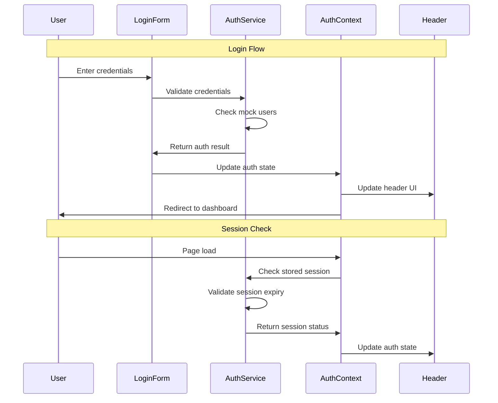

# US-007 User Authentication and Login - Implementation Planning

## User Story

As an office worker user, I want to log in to the shopping platform with my credentials, so that I can access my personalized monitoring lists, price alerts, and shopping plans securely.

## Pre-conditions

- Next.js application is set up with TypeScript
- Tailwind CSS is configured for styling
- PWA configuration is in place (from US-004)
- Header component exists for navigation integration
- Local storage access is available for session management

## Design

### Visual Layout

The authentication system will consist of:
- **Login Page**: Clean, centered form layout with shopping platform branding
- **Login Form**: Email/password fields with validation states
- **Header Integration**: Login/logout button and user status display
- **Dashboard Redirect**: Post-login landing page showing user's personalized content

### Color and Typography

- **Background Colors**: 
  - Primary: bg-white dark:bg-gray-900
  - Form container: bg-white dark:bg-gray-800 with shadow-lg
  - Input fields: bg-gray-50 dark:bg-gray-700 border-gray-300 dark:border-gray-600

- **Typography**:
  - Page title: font-inter text-3xl font-bold text-gray-900 dark:text-white
  - Form labels: font-inter text-sm font-medium text-gray-700 dark:text-gray-300
  - Error messages: text-red-600 dark:text-red-400 text-sm
  - Success messages: text-green-600 dark:text-green-400 text-sm

- **Component-Specific**:
  - Login button: bg-blue-600 text-white hover:bg-blue-700 disabled:bg-gray-400
  - Input focus: ring-blue-500 border-blue-500
  - Error state: border-red-500 ring-red-500

### Interaction Patterns

- **Form Validation**: 
  - Real-time email format validation
  - Password field toggle visibility
  - Submit button disabled during validation/loading
  - Loading spinner on form submission

- **Authentication Flow**:
  - Smooth transitions between login states
  - Toast notifications for success/error feedback
  - Automatic redirect after successful login
  - Remember me checkbox with persistent session

### Measurements and Spacing

- **Login Container**:
  ```
  max-w-md mx-auto mt-16 px-6 py-8
  ```

- **Form Spacing**:
  ```
  - Form fields: space-y-4
  - Button margin: mt-6
  - Link spacing: mt-4 text-center
  - Container padding: p-6 md:p-8
  ```

### Responsive Behavior

- **Desktop (lg: 1024px+)**:
  ```
  - Centered form: max-w-md
  - Full feature visibility
  - Side-by-side layout for remember me
  ```

- **Tablet (md: 768px - 1023px)**:
  ```
  - Adjusted container: max-w-sm
  - Maintained form layout
  - Optimized touch targets
  ```

- **Mobile (sm: < 768px)**:
  ```
  - Full-width container: mx-4
  - Larger touch targets
  - Stacked form elements
  ```

## Technical Requirements

### Component Structure

```
src/app/auth/
├── login/
│   └── page.tsx                    # Login page component
└── _components/
    ├── LoginForm.tsx               # Main login form component
    ├── AuthProvider.tsx            # Authentication context provider
    └── useAuth.ts                  # Authentication hook
src/lib/
├── auth/
│   ├── mock-auth.ts               # Mock authentication service
│   ├── auth-storage.ts            # Local storage management
│   └── auth-types.ts              # Authentication type definitions
```

### Required Components

- LoginForm ⬜
- AuthProvider ⬜
- useAuth hook ⬜
- Mock authentication service ⬜

### State Management Requirements

```typescript
interface AuthState {
  // Authentication States
  isAuthenticated: boolean;
  isLoading: boolean;
  user: User | null;
  
  // Form States
  email: string;
  password: string;
  rememberMe: boolean;
  errors: Record<string, string>;
  
  // Session States
  sessionExpiry: Date | null;
  lastActivity: Date | null;
}

interface User {
  id: string;
  email: string;
  name: string;
  avatar?: string;
  preferences: UserPreferences;
}

interface UserPreferences {
  notifications: boolean;
  theme: 'light' | 'dark' | 'system';
  language: 'en' | 'zh-CN';
}

// Authentication Actions
const authActions = {
  login: (email: string, password: string, rememberMe: boolean) => Promise<void>;
  logout: () => void;
  checkSession: () => boolean;
  updateUser: (user: Partial<User>) => void;
  clearErrors: () => void;
}
```

## Acceptance Criteria

### Layout & Content

1. Login Page Layout
   ```
   - Centered form container
   - Shopping Monitor branding/logo
   - Clean, professional appearance
   - Responsive design for all devices
   ```

2. Form Elements
   ```
   - Email input with validation
   - Password input with show/hide toggle
   - Remember me checkbox
   - Submit button with loading state
   - Error message display area
   ```

3. Navigation Integration
   ```
   - Login/logout button in header
   - User avatar/name display when logged in
   - Protected route handling
   - Home page route protection and redirects
   ```

4. **Home Page Route Protection**
   ```
   - Unauthenticated users visiting "/" redirect to "/auth/login"
   - Authenticated users visiting "/" redirect to "/dashboard" 
   - Seamless navigation without manual intervention
   ```

### Functionality

1. Authentication Flow

   - [ ] Users can enter email and password
   - [ ] Form validates email format and required fields
   - [ ] Mock authentication checks against predefined credentials
   - [ ] Successful login stores session in localStorage
   - [ ] Failed login displays appropriate error messages

2. Session Management

   - [ ] Remember me option extends session duration
   - [ ] User remains logged in across browser sessions
   - [ ] Session expiry is handled gracefully
   - [ ] Logout clears session data completely

3. UI/UX Features
   - [ ] Password visibility toggle functionality
   - [ ] Loading states during authentication
   - [ ] Success/error toast notifications
   - [ ] Responsive design works on mobile devices

### Navigation Rules

- Unauthenticated users are redirected to login page when accessing protected routes
- **Home page (`/`) redirects unauthenticated users to `/auth/login`**
- **Home page (`/`) redirects authenticated users to `/dashboard`**
- Successful login redirects to dashboard or originally requested page
- Logout redirects to login page with session cleared
- Already authenticated users skip login page and go to dashboard

### Error Handling

- Invalid email format shows validation error
- Wrong credentials show "Invalid email or password" message
- Network errors show "Login failed, please try again" message
- Session expiry shows notification and redirects to login

## Modified Files

```
src/app/auth/
├── login/
│   └── page.tsx ⬜                 # Login page
└── _components/
    ├── LoginForm.tsx ⬜             # Login form component
    ├── AuthProvider.tsx ⬜          # Context provider
    └── useAuth.ts ⬜                # Authentication hook

src/lib/auth/
├── mock-auth.ts ⬜                  # Mock authentication service
├── auth-storage.ts ⬜               # Local storage utilities
└── auth-types.ts ⬜                 # Type definitions

src/components/layout/
└── Header.tsx ⬜                    # Update with auth integration

src/pages/
└── index.tsx ⬜                     # NEW: Add home page route protection

src/middleware.ts ⬜                  # Route protection middleware
```

## Status

🟨 IN PROGRESS - BLOCKED ON REDIRECT ISSUE

### Critical Bug: Login Redirect Failure ⚠️

**Issue Status**: [!] Blocked
**Severity**: High - Prevents successful login completion

**Problem Description**:
The authentication system successfully validates credentials and updates state, but the post-login redirect to dashboard fails. Users remain on the login page despite successful authentication.

**Technical Details**:
- Login form correctly calls `router.push('/dashboard')` after successful authentication
- AuthProvider updates `isAuthenticated` state correctly
- Console shows "✅ Login successful, redirecting to: /dashboard"
- No JavaScript errors or infinite loops
- Session data is properly stored in localStorage
- Issue persists even after clearing browser storage

**Current Implementation Status**:
- ✅ Authentication flow (mock credentials validation)
- ✅ Session management (localStorage)
- ✅ Form validation and error handling
- ✅ AuthProvider context setup
- ✅ RouteGuard implementation
- ❌ **Login redirect mechanism** (BROKEN)

**Required Fix**:
Implement reliable post-login navigation to dashboard page. This is blocking the completion of US-007.

**Debugging Tasks**:
1. [ ] Test router.push() Promise handling
2. [ ] Verify Next.js routing configuration
3. [ ] Test alternative redirect methods (router.replace, window.location)
4. [ ] Check for middleware interference
5. [ ] Validate dashboard route accessibility
6. [ ] Add comprehensive router state logging

1. Setup & Configuration

   - [x] Create authentication directory structure
   - [x] Set up TypeScript interfaces for auth state
   - [x] Configure mock user credentials
   - [x] Set up local storage utilities

2. Core Authentication

   - [x] Implement AuthProvider context
   - [x] Create useAuth custom hook
   - [x] Build mock authentication service
   - [x] Implement session management

3. UI Implementation

   - [x] Create LoginForm component
   - [x] Build login page layout
   - [x] Implement form validation
   - [x] Add loading and error states

4. Integration
   - [~] Update Header component with auth state
   - [!] **BLOCKED**: Implement route protection middleware - redirect fails
   - [x] Add logout functionality
   - [!] **BLOCKED**: Test authentication flow - redirect broken

5. Critical Bug Fix Required
   - [ ] **URGENT**: Fix login redirect mechanism
   - [ ] Verify router.push() implementation
   - [ ] Test alternative navigation methods
   - [ ] Add comprehensive redirect debugging
   - [ ] Validate dashboard route configuration

6. **NEW**: Home Page Route Protection
   - [ ] Add RouteGuard to home page (`src/pages/index.tsx`)
   - [ ] Implement redirect logic for unauthenticated users → `/auth/login`
   - [ ] Implement redirect logic for authenticated users → `/dashboard`
   - [ ] Test home page navigation flows
   - [ ] Verify seamless user experience

## Dependencies

- PWA configuration (US-004) - for offline session handling
- Header component - for login/logout integration
- Dashboard page - for post-login redirect
- Toast notification system - for user feedback

## Related Stories

- US-008 (User Registration) - Future extension of authentication system
- US-009 (User Profile Management) - Requires authentication context
- US-001 (Monitor Product Prices) - Requires user session for personalization

## Notes

### Technical Considerations

1. **Mock Authentication Implementation**: Use predefined user credentials stored in configuration
2. **Session Storage**: Implement localStorage-based session with expiry tracking
3. **Security**: Even in mock mode, follow security best practices for form handling
4. **State Management**: Use React Context for global authentication state
5. **Route Protection**: Implement middleware to protect authenticated routes

### Business Requirements

- **MVP Phase**: Mock authentication only - no real backend integration required
- **Demo Credentials**: Provide easy-to-remember test accounts for demonstration
- **Session Duration**: Default 7 days for "remember me", 1 day for regular sessions
- **User Experience**: Smooth, professional authentication flow matching shopping platform expectations

### API Integration

#### Type Definitions

```typescript
interface AuthRequest {
  email: string;
  password: string;
  rememberMe: boolean;
}

interface AuthResponse {
  success: boolean;
  user?: User;
  token?: string;
  expiresAt?: Date;
  error?: string;
}

interface Session {
  userId: string;
  email: string;
  name: string;
  expiresAt: Date;
  rememberMe: boolean;
  createdAt: Date;
}
```

### Mock Implementation

#### Mock Authentication Service

```typescript
// filepath: src/lib/auth/mock-auth.ts
const MOCK_USERS = [
  {
    id: '1',
    email: 'demo@shopmonitor.com',
    password: 'demo123',
    name: 'Demo User',
    avatar: '/avatars/demo-user.jpg'
  },
  {
    id: '2',
    email: 'test@example.com',
    password: 'test123',
    name: 'Test User',
    avatar: '/avatars/test-user.jpg'
  }
];
```

#### Mock Session Storage

```typescript
// filepath: src/lib/auth/auth-storage.ts
interface StoredSession {
  userId: string;
  email: string;
  name: string;
  avatar?: string;
  expiresAt: string;
  rememberMe: boolean;
}

const SESSION_KEY = 'shopping_monitor_session';
const SESSION_DURATION = {
  regular: 24 * 60 * 60 * 1000, // 1 day
  remember: 7 * 24 * 60 * 60 * 1000, // 7 days
};
```

### Authentication Flow



### Custom Hook Implementation

```typescript
const useAuth = () => {
  const context = useContext(AuthContext);
  
  if (!context) {
    throw new Error('useAuth must be used within AuthProvider');
  }

  const login = useCallback(async (email: string, password: string, rememberMe: boolean) => {
    setLoading(true);
    try {
      const result = await mockAuthService.login({ email, password, rememberMe });
      
      if (result.success && result.user) {
        setUser(result.user);
        setIsAuthenticated(true);
        
        // Store session
        authStorage.saveSession({
          userId: result.user.id,
          email: result.user.email,
          name: result.user.name,
          avatar: result.user.avatar,
          expiresAt: result.expiresAt!.toISOString(),
          rememberMe,
        });
        
        return { success: true };
      } else {
        return { success: false, error: result.error || 'Login failed' };
      }
    } catch (error) {
      return { success: false, error: 'Network error' };
    } finally {
      setLoading(false);
    }
  }, []);

  const logout = useCallback(() => {
    setUser(null);
    setIsAuthenticated(false);
    authStorage.clearSession();
    router.push('/auth/login');
  }, []);

  return {
    user,
    isAuthenticated,
    isLoading,
    login,
    logout,
    checkSession: authStorage.getSession,
  };
};
```

## Testing Requirements

### Integration Tests (Target: 80% Coverage)

1. Authentication Flow Tests

```typescript
describe('Authentication Flow', () => {
  it('should login successfully with valid credentials', async () => {
    // Test mock login with demo credentials
  });

  it('should show error message with invalid credentials', async () => {
    // Test failed login attempt
  });

  it('should maintain session across page reloads', async () => {
    // Test session persistence
  });
});
```

2. Form Validation Tests

```typescript
describe('Login Form Validation', () => {
  it('should validate email format', async () => {
    // Test email validation
  });

  it('should require password field', async () => {
    // Test required field validation
  });

  it('should handle form submission states', async () => {
    // Test loading and disabled states
  });
});
```

3. Session Management Tests

```typescript
describe('Session Management', () => {
  it('should handle session expiry correctly', async () => {
    // Test session expiration
  });

  it('should clear session on logout', async () => {
    // Test logout functionality
  });

  it('should respect remember me option', async () => {
    // Test extended session duration
  });
});
```

### Security Tests

```typescript
describe('Security', () => {
  it('should not expose passwords in console or storage', async () => {
    // Test password security
  });

  it('should clear sensitive data on logout', async () => {
    // Test data cleanup
  });
});
```

### Accessibility Tests

```typescript
describe('Accessibility', () => {
  it('should have proper ARIA labels for form fields', async () => {
    // Test accessibility compliance
  });

  it('should handle keyboard navigation correctly', async () => {
    // Test keyboard accessibility
  });
});
```
