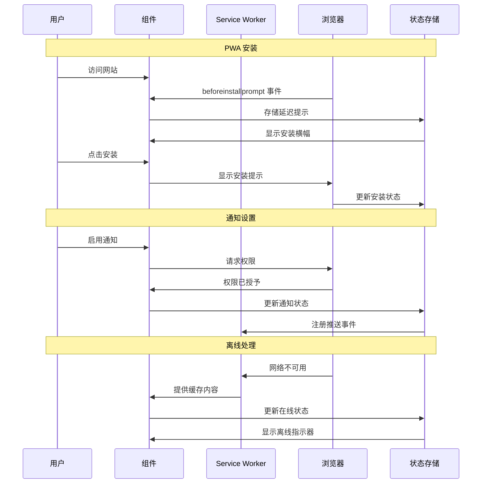

# US-004 通过网页界面访问平台 - 实施规划

## 用户故事

作为上班族，我希望通过网页浏览器或小程序访问购物平台，以便无需下载和安装专用应用程序就能使用服务。

## 前置条件

- Next.js 框架已在项目中设置
- TypeScript 配置已就位
- 基本项目结构已存在，包含 pages 目录
- 没有现有应用程序约束阻止基于 Web 的实现

## 设计

### 视觉布局

Web 平台将具有响应式、现代化界面，针对桌面和移动端使用进行优化：

- **头部导航**：Logo、主导航菜单、用户账户访问
- **主内容区域**：适应不同功能的动态内容区域
- **侧边栏/筛选面板**：可折叠的搜索筛选器和快速操作面板
- **页脚**：链接、联系信息和其他资源
- **响应式网格系统**：适应屏幕尺寸的灵活布局
- **渐进式 Web 应用 (PWA)**：具有离线功能的类应用体验

### 颜色和排版

**背景颜色**：
- 主要：bg-white dark:bg-gray-900
- 次要：bg-gray-50 dark:bg-gray-800
- 强调：bg-blue-500 hover:bg-blue-600
- 成功：bg-green-500
- 警告：bg-yellow-500
- 错误：bg-red-500

**排版**：
- 标题：font-inter text-2xl font-semibold text-gray-900 dark:text-white
- 正文：font-inter text-base text-gray-600 dark:text-gray-300
- 链接：text-blue-600 hover:text-blue-700 dark:text-blue-400
- 小文本：text-sm text-gray-500 dark:text-gray-400

**组件特定**：
- 卡片：bg-white dark:bg-gray-800 shadow-md hover:shadow-lg border border-gray-200 dark:border-gray-700
- 按钮：bg-blue-500 text-white hover:bg-blue-600 active:bg-blue-700 disabled:bg-gray-300
- 输入字段：border-gray-300 dark:border-gray-600 focus:border-blue-500 focus:ring-blue-500

### 交互模式

**按钮交互**：
- 悬停：背景过渡（150ms ease-in-out）
- 点击：缩放至 98%（100ms ease）
- 加载：显示加载图标，禁用交互，将不透明度降至 70%
- 无障碍性：聚焦环（ring-2 ring-blue-500），键盘导航支持

**表单字段交互**：
- 聚焦：带环效果的边框高亮（ring-2 ring-blue-500）
- 验证：成功（border-green-500）/错误（border-red-500）状态带图标
- 帮助文本：动画淡入/淡出（transition-opacity duration-200）
- 无障碍性：适当的标签、ARIA 属性、错误公告

**导航交互**：
- 菜单切换：移动菜单的平滑滑动动画
- 页面过渡：加载状态和平滑过渡
- 面包屑导航：悬停效果和活动状态指示器

### 尺寸和间距

**容器**：
```
max-w-7xl mx-auto px-4 sm:px-6 lg:px-8
```

**组件间距**：
```
- 垂直节奏：space-y-6
- 网格间隙：gap-4 md:gap-6
- 部分内边距：py-8 md:py-12 lg:py-16
- 卡片内边距：p-4 md:p-6
- 按钮内边距：px-4 py-2 md:px-6 md:py-3
```

**布局尺寸**：
```
- 头部高度：h-16 md:h-20
- 侧边栏宽度：w-64 lg:w-72
- 内容最大宽度：max-w-4xl
- 卡片最小高度：min-h-48
```

### 响应式行为

**桌面端（lg: 1024px+）**：
```
- 网格：grid-cols-3 lg:grid-cols-4 gap-6
- 侧边栏：w-72 fixed left-0
- 排版：text-base
- 导航：水平全菜单
```

**平板端（md: 768px - 1023px）**：
```
- 网格：grid-cols-2 md:grid-cols-3 gap-4
- 侧边栏：w-64 滑动面板
- 排版：text-sm
- 导航：折叠汉堡菜单
```

**移动端（sm: < 768px）**：
```
- 堆叠布局：flex flex-col space-y-4
- 全宽元素：w-full
- 隐藏侧边栏：带遮罩层的滑动覆盖
- 排版：text-sm
- 导航：移动汉堡菜单
```

## 技术要求

### 组件结构

```
src/app/
├── layout.tsx                     # 根布局，包含头部/页脚
├── page.tsx                       # 首页
├── globals.css                    # 全局样式
└── _components/
    ├── Header.tsx                 # 主导航头部
    ├── Footer.tsx                 # 网站页脚
    ├── Navigation.tsx             # 导航菜单组件
    ├── MobileMenu.tsx             # 移动汉堡菜单
    ├── ThemeToggle.tsx            # 深色/浅色模式切换
    ├── NotificationBanner.tsx     # 价格提醒通知
    └── PWAInstallPrompt.tsx       # PWA 安装提示

src/lib/
├── pwa-utils.ts                   # PWA 安装实用工具
└── notification-utils.ts         # 浏览器通知助手

public/
├── manifest.json                  # PWA 清单
├── sw.js                         # Service Worker
└── icons/                        # PWA 图标
```

### 必需组件

- Header ⬜
- Footer ⬜
- Navigation ⬜
- MobileMenu ⬜
- ThemeToggle ⬜
- NotificationBanner ⬜
- PWAInstallPrompt ⬜
- PWA Configuration ⬜

### 状态管理要求

```typescript
interface AppState {
  // UI 状态
  isMobileMenuOpen: boolean;
  isDarkMode: boolean;
  isLoading: boolean;
  
  // PWA 状态
  isPWAInstallable: boolean;
  isInstalled: boolean;
  deferredPrompt: any | null;
  
  // 通知状态
  notificationsEnabled: boolean;
  notificationPermission: NotificationPermission;
  
  // 用户偏好
  preferences: {
    theme: 'light' | 'dark' | 'system';
    notifications: boolean;
    language: 'en' | 'zh-CN';
  };
}

// 状态更新
const actions = {
  toggleMobileMenu: () => void;
  setTheme: (theme: 'light' | 'dark' | 'system') => void;
  setPWAInstallable: (installable: boolean) => void;
  enableNotifications: () => Promise<boolean>;
  updatePreferences: (prefs: Partial<UserPreferences>) => void;
}
```

## 验收标准

### 布局和内容

1. 头部部分
   ```
   - Logo/品牌（左对齐）
   - 主导航（居中或右对齐）
   - 用户操作/主题切换（右对齐）
   - 响应式：在移动端折叠为汉堡菜单
   - 滚动时粘性定位
   ```

2. 主内容区域
   ```
   - 具有最大宽度的响应式容器
   - 适当的间距和排版
   - 可访问的颜色对比度
   - 动态内容的加载状态
   ```

3. 页脚部分
   ```
   - 链接和法律信息
   - 社交媒体链接
   - 联系信息
   - 响应式布局
   ```

### 功能

1. **响应式 Web 界面**

   - [ ] 平台在桌面浏览器上加载和运行（Chrome、Firefox、Safari、Edge）
   - [ ] 平台在移动浏览器上加载和运行（iOS Safari、Chrome Mobile）
   - [ ] 布局适当地适应不同屏幕尺寸（320px 到 2560px+）
   - [ ] 触摸交互在移动设备上正常工作
   - [ ] 所有交互元素的键盘导航正常工作

2. **渐进式 Web 应用（PWA）功能**

   - [ ] PWA manifest.json 配置正确
   - [ ] Service Worker 实现离线功能
   - [ ] 安装提示在兼容浏览器上出现
   - [ ] 应用程序可安装到设备主屏幕
   - [ ] 网络不可用时显示离线页面

3. **性能和用户体验**
   - [ ] 初始页面加载在 3G 网络上 3 秒内完成
   - [ ] 首次内容绘制（FCP）在 1.8 秒内发生
   - [ ] 交互元素在 100ms 内响应
   - [ ] 平滑动画和过渡（60fps）
   - [ ] 页面可通过适当的 URL 收藏

### 导航规则

- 所有导航应保持当前页面上下文
- 浏览器后退按钮应按预期工作
- 外部链接应在新标签中打开，并具有适当的安全属性
- 面包屑导航应显示当前位置
- 导航到新页面时移动菜单应关闭

### 错误处理

- 网络错误应显示用户友好的消息和重试选项
- 页面加载失败应显示自定义 404/500 错误页面
- Service Worker 应缓存基本页面以供离线访问
- 当 JavaScript 被禁用时优雅降级

## 修改的文件

```
src/app/
├── layout.tsx ⬜
├── page.tsx ⬜
├── globals.css ⬜
└── _components/
    ├── Header.tsx ⬜
    ├── Footer.tsx ⬜
    ├── Navigation.tsx ⬜
    ├── MobileMenu.tsx ⬜
    ├── ThemeToggle.tsx ⬜
    ├── NotificationBanner.tsx ⬜
    └── PWAInstallPrompt.tsx ⬜

src/lib/
├── pwa-utils.ts ⬜
└── notification-utils.ts ⬜

src/types/
└── app.ts ⬜

public/
├── manifest.json ⬜
├── sw.js ⬜
└── icons/ ⬜

next.config.ts ⬜
```

## 状态

🟨 进行中

1. 设置和配置

   - [ ] 在 next.config.ts 中配置 PWA 设置
   - [ ] 设置 Service Worker 配置
   - [ ] 创建 PWA manifest.json
   - [ ] 生成多种尺寸的 PWA 图标

2. 布局实现

   - [ ] 创建响应式头部组件
   - [ ] 实现移动导航菜单
   - [ ] 构建页脚组件
   - [ ] 设置全局布局结构

3. 功能实现

   - [ ] 实现主题切换（深色/浅色模式）
   - [ ] 添加 PWA 安装提示
   - [ ] 配置浏览器通知
   - [ ] 实现离线功能
   - [ ] 添加加载状态和错误边界

4. 测试
   - [ ] 跨浏览器兼容性测试
   - [ ] 移动设备测试
   - [ ] PWA 安装测试
   - [ ] 性能测试（Lighthouse）
   - [ ] 无障碍性测试

## 依赖项

- Next.js 14+ 带 App Router
- Tailwind CSS 样式
- PWA 配置库（next-pwa 或 workbox）
- TypeScript 类型安全

## 相关故事

- US-001（监控商品价格）- 需要价格监控的 Web 界面
- US-006（接收价格通知）- 浏览器通知集成

## 备注

### 技术考虑

1. **PWA 实现**：使用 next-pwa 或手动 Service Worker 设置离线功能
2. **性能优化**：实现代码分割和懒加载以获得最佳加载时间
3. **无障碍性**：确保所有组件符合 WCAG 2.1 AA 标准
4. **SEO 优化**：适当的元标签、结构化数据和 Open Graph 标签
5. **浏览器兼容性**：支持现代浏览器并优雅降级

### 业务需求

- 平台必须在不安装应用的情况下工作，以减少用户摩擦
- 工作休息时间的快速访问需要快速加载时间
- 移动优先方法，因为上班族可能在通勤时使用手机
- 收藏功能对重复使用至关重要

### API 集成

#### 类型定义

```typescript
interface PWAInstallEvent extends Event {
  prompt(): Promise<void>;
  userChoice: Promise<{
    outcome: 'accepted' | 'dismissed';
    platform: string;
  }>;
}

interface NotificationOptions {
  body?: string;
  icon?: string;
  badge?: string;
  tag?: string;
  renotify?: boolean;
  requireInteraction?: boolean;
  actions?: NotificationAction[];
}

interface AppPreferences {
  theme: 'light' | 'dark' | 'system';
  notifications: boolean;
  language: 'en' | 'zh-CN';
  pwaInstalled: boolean;
}

interface AppState {
  isOnline: boolean;
  isLoading: boolean;
  isMobileMenuOpen: boolean;
  preferences: AppPreferences;
  deferredPrompt: PWAInstallEvent | null;
}
```

### 模拟实现

#### 模拟服务器配置

```typescript
// 文件路径：mocks/stub.ts
const mocks = [
  {
    endPoint: '/api/preferences',
    json: 'user-preferences.json',
  },
  {
    endPoint: '/api/notification-settings',
    json: 'notification-settings.json',
  },
];
```

#### 模拟响应

```json
// 文件路径：mocks/responses/user-preferences.json
{
  "status": "SUCCESS",
  "data": {
    "preferences": {
      "theme": "system",
      "notifications": true,
      "language": "zh-CN",
      "pwaInstalled": false
    },
    "capabilities": {
      "notificationSupport": true,
      "pwaSupport": true,
      "offlineSupport": true
    }
  }
}
```

### 状态管理流程



### 自定义 Hook 实现

```typescript
const usePWA = () => {
  const [deferredPrompt, setDeferredPrompt] = useState<PWAInstallEvent | null>(null);
  const [isInstalled, setIsInstalled] = useState(false);

  useEffect(() => {
    const handleBeforeInstallPrompt = (e: PWAInstallEvent) => {
      e.preventDefault();
      setDeferredPrompt(e);
    };

    const handleAppInstalled = () => {
      setIsInstalled(true);
      setDeferredPrompt(null);
    };

    window.addEventListener('beforeinstallprompt', handleBeforeInstallPrompt);
    window.addEventListener('appinstalled', handleAppInstalled);

    // 检查是否已安装
    if (window.matchMedia('(display-mode: standalone)').matches) {
      setIsInstalled(true);
    }

    return () => {
      window.removeEventListener('beforeinstallprompt', handleBeforeInstallPrompt);
      window.removeEventListener('appinstalled', handleAppInstalled);
    };
  }, []);

  const installPWA = useCallback(async () => {
    if (!deferredPrompt) return false;

    deferredPrompt.prompt();
    const { outcome } = await deferredPrompt.userChoice;
    
    if (outcome === 'accepted') {
      setDeferredPrompt(null);
      return true;
    }
    
    return false;
  }, [deferredPrompt]);

  return {
    canInstall: !!deferredPrompt,
    isInstalled,
    installPWA,
  };
};

const useNotifications = () => {
  const [permission, setPermission] = useState<NotificationPermission>('default');

  useEffect(() => {
    if ('Notification' in window) {
      setPermission(Notification.permission);
    }
  }, []);

  const requestPermission = useCallback(async () => {
    if (!('Notification' in window)) return false;

    const result = await Notification.requestPermission();
    setPermission(result);
    return result === 'granted';
  }, []);

  const showNotification = useCallback((title: string, options?: NotificationOptions) => {
    if (permission !== 'granted') return;

    return new Notification(title, {
      icon: '/icons/icon-192x192.png',
      badge: '/icons/badge-72x72.png',
      ...options,
    });
  }, [permission]);

  return {
    permission,
    isSupported: 'Notification' in window,
    requestPermission,
    showNotification,
  };
};
```

## 测试要求

### 集成测试（目标：80% 覆盖率）

1. 核心功能测试

```typescript
describe('Web 平台访问', () => {
  it('应该在网页浏览器中加载平台', async () => {
    // 测试平台加载
  });

  it('应该在不同屏幕尺寸下显示响应式布局', async () => {
    // 测试响应式行为
  });

  it('应该在不安装应用的情况下保持功能', async () => {
    // 测试仅 Web 使用
  });
});
```

2. PWA 测试

```typescript
describe('PWA 功能', () => {
  it('应该成功注册 Service Worker', async () => {
    // 测试 Service Worker 注册
  });

  it('应该在满足条件时提示安装', async () => {
    // 测试 PWA 安装提示
  });

  it('应该使用缓存内容离线工作', async () => {
    // 测试离线功能
  });
});
```

3. 跨浏览器测试

```typescript
describe('浏览器兼容性', () => {
  it('应该在 Chrome 桌面和移动端工作', async () => {
    // 测试 Chrome 兼容性
  });

  it('应该在 Safari 桌面和移动端工作', async () => {
    // 测试 Safari 兼容性
  });

  it('应该在旧浏览器中优雅降级', async () => {
    // 测试渐进增强
  });
});
```

### 性能测试

1. 加载性能

```typescript
describe('性能', () => {
  it('应该在 3G 网络上 3 秒内加载初始页面', async () => {
    // 测试加载性能
  });

  it('应该在 1.8 秒内实现 FCP', async () => {
    // 测试首次内容绘制
  });

  it('应该在 100ms 内响应交互', async () => {
    // 测试交互响应性
  });
});
```

2. 资源管理

```typescript
describe('资源管理', () => {
  it('应该缓存关键资源以供离线使用', async () => {
    // 测试缓存策略
  });

  it('应该懒加载非关键资源', async () => {
    // 测试懒加载
  });
});
```

### 无障碍性测试

```typescript
describe('无障碍性', () => {
  it('应该符合 WCAG 2.1 AA 标准', async () => {
    // 测试无障碍性合规
  });

  it('应该支持键盘导航', async () => {
    // 测试键盘无障碍性
  });

  it('应该与屏幕阅读器兼容', async () => {
    // 测试屏幕阅读器兼容性
  });
});
```

## 功能文档

此实施计划为构建响应式、可访问的 Web 平台提供了全面的基础，上班族可以在不安装专用应用的情况下使用该平台。对 PWA 功能的关注确保了类似应用的体验，同时保持了 Web 访问的便利性。

技术方法优先考虑性能、无障碍性和用户体验，解决用户故事中提到的具体需求。响应式设计确保平台在所有设备上有效工作，而 PWA 功能为选择安装的用户提供增强功能。
